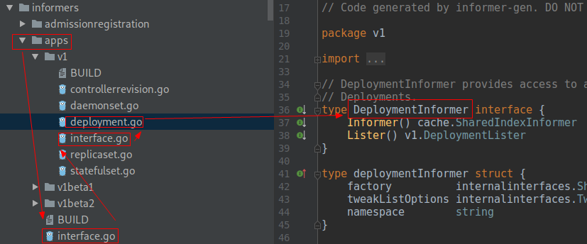
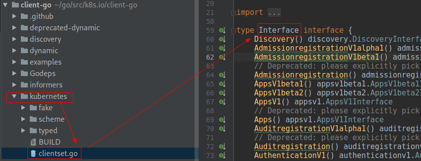

# Custom Controller 之 Informer(二)

## 概述

## GenericInformer

!FILENAME informers/generic.go:58

```go
type GenericInformer interface {
   Informer() cache.SharedIndexInformer
   Lister() cache.GenericLister
}

type genericInformer struct {
   informer cache.SharedIndexInformer
   resource schema.GroupResource
}
```

### SharedIndexInformer

### GenericLister

## SharedInformerFactory

!FILENAME informers/factory.go:185

```go
type SharedInformerFactory interface {
   internalinterfaces.SharedInformerFactory
   ForResource(resource schema.GroupVersionResource) (GenericInformer, error)
   WaitForCacheSync(stopCh <-chan struct{}) map[reflect.Type]bool

   Admissionregistration() admissionregistration.Interface
   Apps() apps.Interface
   Auditregistration() auditregistration.Interface
   Autoscaling() autoscaling.Interface
   Batch() batch.Interface
   Certificates() certificates.Interface
   Coordination() coordination.Interface
   Core() core.Interface
   Events() events.Interface
   Extensions() extensions.Interface
   Networking() networking.Interface
   Policy() policy.Interface
   Rbac() rbac.Interface
   Scheduling() scheduling.Interface
   Settings() settings.Interface
   Storage() storage.Interface
}
```


### apps.Interface



从 apps.Interface 一路到 DeploymentInformer

!FILENAME informers/apps/interface.go:29

```go
type Interface interface {
   // V1 provides access to shared informers for resources in V1.
   V1() v1.Interface
   // V1beta1 provides access to shared informers for resources in V1beta1.
   V1beta1() v1beta1.Interface
   // V1beta2 provides access to shared informers for resources in V1beta2.
   V1beta2() v1beta2.Interface
}
```

#### v1.Interface

!FILENAME informers/apps/v1/interface.go:26

```go
type Interface interface {
   // ControllerRevisions returns a ControllerRevisionInformer.
   ControllerRevisions() ControllerRevisionInformer
   // DaemonSets returns a DaemonSetInformer.
   DaemonSets() DaemonSetInformer
   // Deployments returns a DeploymentInformer.
   Deployments() DeploymentInformer
   // ReplicaSets returns a ReplicaSetInformer.
   ReplicaSets() ReplicaSetInformer
   // StatefulSets returns a StatefulSetInformer.
   StatefulSets() StatefulSetInformer
}
```

#### DeploymentInformer

!FILENAME informers/apps/v1/deployment.go:36

```go
type DeploymentInformer interface {
   Informer() cache.SharedIndexInformer
   Lister() v1.DeploymentLister
}
```

**deploymentInformer**

!FILENAME informers/apps/v1/deployment.go:41

```go
type deploymentInformer struct {
   factory          internalinterfaces.SharedInformerFactory
   tweakListOptions internalinterfaces.TweakListOptionsFunc
   namespace        string
}
```

!FILENAME informers/apps/v1/deployment.go:79

```go
func (f *deploymentInformer) defaultInformer(client kubernetes.Interface, resyncPeriod time.Duration) cache.SharedIndexInformer {
	return NewFilteredDeploymentInformer(client, f.namespace, resyncPeriod, cache.Indexers{cache.NamespaceIndex: cache.MetaNamespaceIndexFunc}, f.tweakListOptions)
}

func (f *deploymentInformer) Informer() cache.SharedIndexInformer {
   return f.factory.InformerFor(&appsv1.Deployment{}, f.defaultInformer)
}

func (f *deploymentInformer) Lister() v1.DeploymentLister {
   return v1.NewDeploymentLister(f.Informer().GetIndexer())
}
```

### sharedInformerFactory

!FILENAME informers/factory.go:53

```go
type sharedInformerFactory struct {
   client           kubernetes.Interface
   namespace        string
   tweakListOptions internalinterfaces.TweakListOptionsFunc
   lock             sync.Mutex
   defaultResync    time.Duration
   customResync     map[reflect.Type]time.Duration

   informers map[reflect.Type]cache.SharedIndexInformer
   // startedInformers is used for tracking which informers have been started.
   // This allows Start() to be called multiple times safely.
   startedInformers map[reflect.Type]bool
}
```

#### kubernetes.Interface



#### Clientset

```go
type Clientset struct {
   *discovery.DiscoveryClient
   admissionregistrationV1alpha1 *admissionregistrationv1alpha1.AdmissionregistrationV1alpha1Client
   admissionregistrationV1beta1  *admissionregistrationv1beta1.AdmissionregistrationV1beta1Client
   appsV1beta1                   *appsv1beta1.AppsV1beta1Client
   appsV1beta2                   *appsv1beta2.AppsV1beta2Client
   appsV1                        *appsv1.AppsV1Client
   // ……
   coreV1                        *corev1.CoreV1Client
   eventsV1beta1                 *eventsv1beta1.EventsV1beta1Client
   extensionsV1beta1             *extensionsv1beta1.ExtensionsV1beta1Client
   // ……
}
```

#### appsv1.AppsV1Client

!FILENAME kubernetes/typed/apps/v1/apps_client.go:38

```go
type AppsV1Client struct {
   restClient rest.Interface
}
```

#### rest.Interface

```go
type Interface interface {
   GetRateLimiter() flowcontrol.RateLimiter
   Verb(verb string) *Request
   Post() *Request
   Put() *Request
   Patch(pt types.PatchType) *Request
   Get() *Request
   Delete() *Request
   APIVersion() schema.GroupVersion
}
```

#### RESTClient

!FILENAME rest/client.go:61

```go
type RESTClient struct {
   // base is the root URL for all invocations of the client
   base *url.URL
   versionedAPIPath string
   contentConfig ContentConfig
   serializers Serializers
   createBackoffMgr func() BackoffManager
   Throttle flowcontrol.RateLimiter
   Client *http.Client
}
```