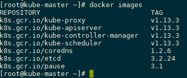
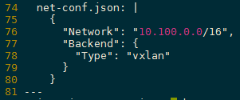
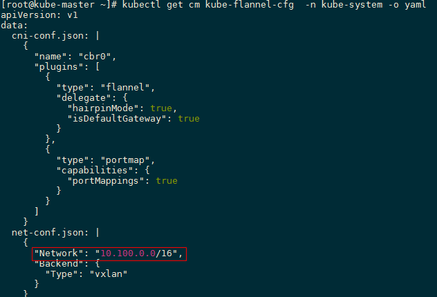
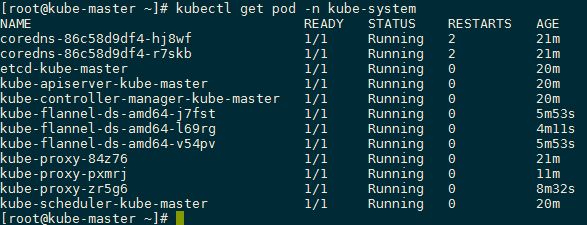

# 测试环境搭建-三节点

（k8s-1.13版本三节点环境搭建）

<!-- toc -->

## 概述

写在前面：本节不建议在未阅读上一节（单机版环境搭建）的情况下阅读。下面内容稍稍随意，上一节提过的就不重复了。另外都是使用kubeadm实现，没有本质区别，所以下文从简。

前面一节讲了单节点的环境搭建，在调试调度策略等场景的时候单节点不好说明问题，所以今天补一个3节点的集群搭建过程。1个笔记本搭建3节点确实有点压力，外加要源码编译，调试，着实卡到不行。大伙不需要一开始先折腾好环境。在看源码遇到困惑，需要上环境调试或者验证特性单机不够用时再倒腾吧。下附我当前渣渣笔记本配置：


## 系统准备

和上一节同样的配置方式，这里不再赘述。我这里3个节点基本信息如下：

| ip             | hostname    | 用途        |
| -------------- | ----------- | ----------- |
| 29.123.161.240 | kube-master | master 节点 |
| 29.123.161.207 | kube-node1  | node 节点   |
| 29.123.161.208 | kube-node2  | node 节点   |

每个节点的/etc/hosts配置：


## 镜像和rpms

镜像和rpm包的获取方式和上一节一样，node节点并不需要安装和master一样的rpm包，也不需要全部的镜像，不过我贪方便，直接在3个节点放了一样的“包”；我用的是离线的虚拟机，所以是一下子拷贝了rpm包和镜像tar包这些进去，去区分还不如直接全部装，大家按需自己灵活决定～.




## 安装master

运行init命令：

```sh
kubeadm init --pod-network-cidr=10.100.0.0/16 --kubernetes-version=v1.13.3 --apiserver-advertise-address 29.123.161.240 --service-cidr=10.101.0.0/16
```

运行结束后我们看到如下输出：


对着输出信息初始化：


## 添加node节点

在2个node节点执行同样的kube join命令（具体命令master安装完输出的信息里可以找到）：


## 安装flannel

和上一节一样下载yaml文件，镜像可以提前下载好（如果网络不给力）。

yml文件本地链接：<[点击查看](../staging/yaml/kube-flannel.yml)>

执行`kubectl create -f kube-flannel.yml`（同样因为这里自定义了pod的cidr，所以这里需要修改flannel的yaml配置；如果已经创建了资源，同样可以通过修改configmap实现）；



对应的configmap资源：



稍等一会查看pod状态



查看node状态：


## 环境验证

同样我们用tomcat镜像来测试：

```yaml
apiVersion: apps/v1
kind: Deployment
metadata:
  name: tomcat
spec:
  replicas: 2
  selector:
    matchLabels:
      app: tomcat
  template:
    metadata:
      name: tomcat
      labels:
        app: tomcat
    spec:
      containers:
      - name: tomcat
        image: tomcat:8
        ports:
        - containerPort: 8080
---
apiVersion: v1
kind: Service
metadata:
  name: tomcat-svc
spec:
  selector:
    app: tomcat
  ports:
  - name: http
    port: 8080
    targetPort: 8080
    protocol: TCP
```

创建资源：


查看pod和svc：


通过svc访问tomcat服务：


ok，3节点的环境验证各种特性基本都够用～