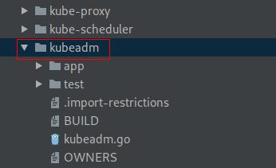
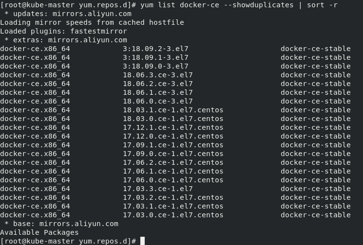
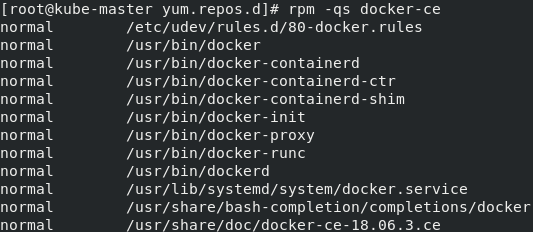
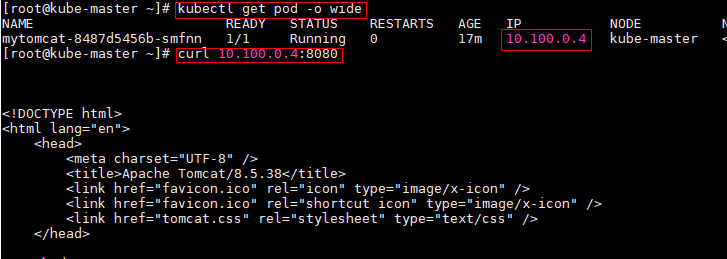

# 测试环境搭建

（k8s-1.13版本单节点环境搭建）

## 概述

> 大家注意哦，不一定要先搭建好环境再看源码，大可以先看一个组件，感觉差不多理解了，想要run一把，想要改几行试试的时候回过头来搭建k8s环境。
>
> 当然，大家开始看源码的时候，我相信各位都是搭建过不少次k8s集群，敲过N多次kubectl命令了，所以下面我不会解释太基础的命令是做什么的。

今天我们要做的是搭建一个单机版的k8s环境，用于后面的学习。虽然k8s的环境搭建没有openstack来的复杂，但是由于网络等乱七八糟的问题，在国内手动搭建一个五脏俱全的k8s也不算太容易，一个不小心就会被乱七八遭的障碍磨灭兴趣。今天看看我能不能让大家觉得这个过程无痛吧～

## kubeadm简介

选择一个好的工具很重要！大家在刚开始学习k8s的时候应该都用二进制文件一步一步搭建过集群吧，那个过程是不是很酸爽？手动一步一步搭建环境对于初学者来说确实大有裨益，可以了解各个组件的细节。我已经懒掉了，我决定从众多k8s自动化安装方案中选择一个来搭建这次的k8s环境。

kubeadm是Kubernetes官方提供的用于快速安装Kubernetes集群的工具，这不是一个单独的项目哦，我们在kubernetes源码里可以看到这个组件（`kubernetes/cmd/kubeadm/`）：



kubeadm这个工具可以通过简单的`kubeadm init`和`kubeadm join`命令来创建一个kubernetes集群，kubeadm提供的其他命令都比较通俗易懂：

- `kubeadm init` 启动一个master节点；
- `kubeadm join` 启动一个node节点，加入master；
- `kubeadm upgrade` 更新集群版本；
- `kubeadm config` 从1.8.0版本开始已经用处不大，可以用来view一下配置；
- `kubeadm token` 管理`kubeadm join`的token；
- `kubeadm reset` 把`kubeadm init`或`kubeadm join`做的更改恢复原状；
- `kubeadm version`打印版本信息；
- `kubeadm alpha`预览一些alpha特性的命令。

关于kubeadm的成熟度官方有一个表格：

| Area                      | Maturity Level |
| ------------------------- | -------------- |
| Command line UX           | GA             |
| Implementation            | GA             |
| Config file API           | beta           |
| CoreDNS                   | GA             |
| kubeadm alpha subcommands | alpha          |
| High availability         | alpha          |
| DynamicKubeletConfig      | alpha          |
| Self-hosting              | alpha          |

主要特性其实都已经GA了，虽然还有一些小特性仍处于活跃开发中，但是整体已经接近准生产级别了。对于我们的场景来说用起来已经绰绰有余！

## 操作系统准备

我们先使用一个机子来装，后面需要拓展可以增加节点，使用`kubeadm join`可以很轻松扩展集群。

### 系统信息

- 内存：2G
- CPU：2
- 磁盘：20G

系统版本和内核版本如下所示，大家不需要严格和我保持一致，不要使用太旧的就行了。

\# cat /etc/redhat-release 

CentOS Linux release 7.5.1804 (Core)

\# uname -r

3.10.0-862.9.1.el7.x86_64


### 配置selinux和firewalld

```shell
# Set SELinux in permissive mode
setenforce 0
sed -i 's/^SELINUX=enforcing$/SELINUX=permissive/' /etc/selinux/config
# Stop and disable firewalld
systemctl disable firewalld --now
```

### 系统参数与内核模块

```shell
# 修改内核参数
cat <<EOF > /etc/sysctl.d/k8s.conf
net.bridge.bridge-nf-call-ip6tables = 1
net.bridge.bridge-nf-call-iptables = 1
EOF
sysctl --system

# 加载内核模块
modprobe br_netfilter
lsmod | grep br_netfilter
```

### 配置yum源

```shell
# base repo
cd /etc/yum.repos.d
mv CentOS-Base.repo CentOS-Base.repo.bak
curl -o CentOS-Base.repo http://mirrors.aliyun.com/repo/Centos-7.repo
sed -i 's/gpgcheck=1/gpgcheck=0/g' /etc/yum.repos.d/CentOS-Base.repo

# docker repo
curl -o docker-ce.repo http://mirrors.aliyun.com/docker-ce/linux/centos/docker-ce.repo

# k8s repo
cat <<EOF > /etc/yum.repos.d/kubernetes.repo
[kubernetes]
name=Kubernetes
baseurl=http://mirrors.aliyun.com/kubernetes/yum/repos/kubernetes-el7-x86_64
enabled=1
gpgcheck=0
repo_gpgcheck=0
gpgkey=http://mirrors.aliyun.com/kubernetes/yum/doc/yum-key.gpg
        http://mirrors.aliyun.com/kubernetes/yum/doc/rpm-package-key.gpg
EOF

# update cache
yum clean all  
yum makecache  
yum repolist
```

最终我们可以看到这些repo：


### 禁用swap

```sh
swapoff -a
echo "vm.swappiness = 0">> /etc/sysctl.conf
sysctl -p
```


## 安装docker

先看一下有哪些可用版本：`yum list docker-ce --showduplicates | sort -r`



- 我们选择一个版本安装：

`yum install docker-ce-<VERSION STRING>`

- 这里我选择18.03.1，所以我用的命令是：

`yum install docker-ce-18.06.3.ce`

- 可以用rpm命令看一下docker-ce这个rpm包带来了哪些文件：



- 启动docker：

`systemctl enable docker --now`

- 查看服务状态：

`systemctl status docker`

## 安装kubeadm、kubelet和kubectl

kubeadm不管kubelet和kubectl，所以我们需要手动安装kubelet和kubectl：

`yum install -y kubelet kubeadm kubectl --disableexcludes=kubernetes`

如果你看到这个教程的时候yum源里已经有了1.14版本的kubeadm，那么要么你装新版本，要么通过上面装docker同样的方式指定1.13版本安装，我这里使用的是1.13.3。

最后启动kubelet：

`systemctl enable --now kubelet`

## 镜像准备

为了解决国内普遍访问不到k8s.gcr.io的问题，我们从mirrorgooglecontainers下载image，然后打个tag来绕过网络限制：

```shell
docker pull docker.io/mirrorgooglecontainers/kube-apiserver-amd64:v1.13.3
docker tag docker.io/mirrorgooglecontainers/kube-apiserver-amd64:v1.13.3 k8s.gcr.io/kube-apiserver:v1.13.3
docker pull docker.io/mirrorgooglecontainers/kube-controller-manager-amd64:v1.13.3
docker tag docker.io/mirrorgooglecontainers/kube-controller-manager-amd64:v1.13.3 k8s.gcr.io/kube-controller-manager:v1.13.3
docker pull docker.io/mirrorgooglecontainers/kube-scheduler-amd64:v1.13.3
docker tag docker.io/mirrorgooglecontainers/kube-scheduler-amd64:v1.13.3 k8s.gcr.io/kube-scheduler:v1.13.3
docker pull docker.io/mirrorgooglecontainers/kube-proxy-amd64:v1.13.3
docker tag docker.io/mirrorgooglecontainers/kube-proxy-amd64:v1.13.3 k8s.gcr.io/kube-proxy:v1.13.3
docker pull docker.io/mirrorgooglecontainers/pause-amd64:3.1
docker tag docker.io/mirrorgooglecontainers/pause-amd64:3.1 k8s.gcr.io/pause:3.1
docker pull docker.io/mirrorgooglecontainers/etcd-amd64:3.2.24
docker tag docker.io/mirrorgooglecontainers/etcd-amd64:3.2.24 k8s.gcr.io/etcd:3.2.24
docker pull docker.io/coredns/coredns:1.2.6
docker tag docker.io/coredns/coredns:1.2.6 k8s.gcr.io/coredns:1.2.6
```

## 安装k8s master

`kubeadm init --pod-network-cidr=10.100.0.0/16`

如上，跑`kubeadm init`命令后等几分钟。

如果遇到报错，对着错误信息修正一下。比如没有关闭swap会遇到error，系统cpu不够会遇到error，网络不通等等都会出错，仔细看一下错误信息一般都好解决～

跑完上面的init命令后，会看到类似如下的输出：

```sh
Your Kubernetes master has initialized successfully!

To start using your cluster, you need to run the following as a regular user:

  mkdir -p $HOME/.kube
  sudo cp -i /etc/kubernetes/admin.conf $HOME/.kube/config
  sudo chown $(id -u):$(id -g) $HOME/.kube/config

You should now deploy a pod network to the cluster.
Run "kubectl apply -f [podnetwork].yaml" with one of the options listed at:
  https://kubernetes.io/docs/concepts/cluster-administration/addons/

You can now join any number of machines by running the following on each node
as root:

  kubeadm join 192.168.19.100:6443 --token i472cq.tr9a81qxnyqc5zj2 --discovery-token-ca-cert-hash sha256:acba957db29e0efbffe2cf4e484521b3b7e0f9d5c2ab7f9db68a5e31565d0d66
```

上面输出告诉我们还需要做一些工作：

```sh
mkdir -p $HOME/.kube
sudo cp -i /etc/kubernetes/admin.conf $HOME/.kube/config
sudo chown $(id -u):$(id -g) $HOME/.kube/config

# flannel
kubectl apply -f https://raw.githubusercontent.com/coreos/flannel/bc79dd1505b0c8681ece4de4c0d86c5cd2643275/Documentation/kube-flannel.yml
```

稍等一会，应该可以看到node状态变成ready：

\# kubectl get node

NAME          STATUS   ROLES    AGE   VERSION

kube-master   Ready    master   23m   v1.13.3

如果你的环境迟迟都是NotReady状态，可以`kubectl get pod -n kube-system`看一下pod状态，一般可以发现问题，比如flannel的镜像下载失败啦～

当node Ready的时候，我们可以看到pod也全部ready了：


再看一下核心组件状态：


最后注意到kube-master这个node上有一个Taint：

\# kubectl describe node kube-master | grep Taints

Taints: node-role.kubernetes.io/master:NoSchedule

默认master节点是不跑业务pod的，我们暂时只有一个node，所以先去掉这个Taint：

\# kubectl taint node kube-master node-role.kubernetes.io/master-

node/kube-master untainted

\# kubectl describe node kube-master | grep Taints

Taints:             &lt;none&gt;

## 环境验证

我们来跑一个pod，证明环境正常可用了：

写一个yaml：

```yaml
apiVersion: apps/v1
kind: Deployment
metadata:
  name: mytomcat
spec:
  replicas: 1
  selector:
    matchLabels:
      app: mytomcat
  template:
    metadata:
      name: mytomcat
      labels:
        app: mytomcat
    spec:
      containers:
      - name: mytomcat
        image: tomcat:8
        ports:
        - containerPort: 8080
```

如上内容保存为`tomcat-deploy.yaml`，执行`kubectl create -f tomcat-deploy.yaml`，然后看pod状态：


确认了，是熟悉的Running，哈哈，基本算大功告成了！最后我们看一下tomcat服务能不能访问到：



很完美，如果加个svc配置，就能够通过浏览器访问到汤姆猫界面了！
