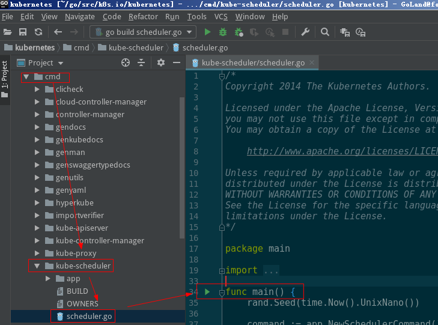
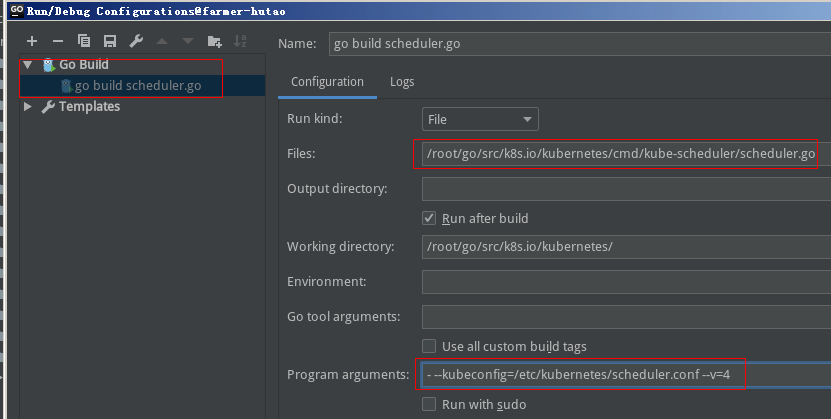
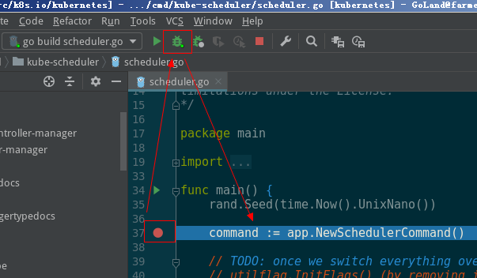
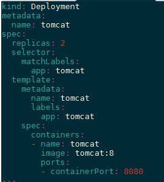
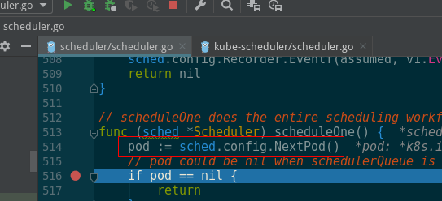
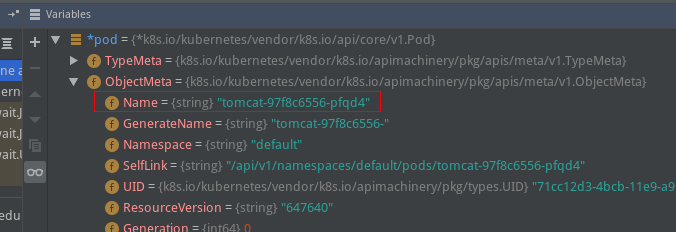

# 源码调试

<!-- toc -->

## 概述

本节内容并不是在准备好k8s环境后就写的，大家也不需要在开始看源码前研究怎么调试代码。今天之前我已经发了《调度器优选过程》也就是差不多准备好k8s环境后一个月了。所以大家也可以先跳过本节，先开始看后面的源码分析，灵活把握开始调试源码的时间吧。

Debug应该是所有“攻城狮”的基本技能。除非是“Hello World”之类的小程序，不然都会出错，俗称bug，有bug就要debug. 今天不赘述调试本身的技术，我们只以调度器为例聊聊怎么把k8s的代码单步执行跑起来，看看内存里是个啥～

## k8s环境

我们前面已经搭建了3节点的集群，相关组件主要是**static pod**的方式在运行，所以调试调度器的时候我们应该把kube-scheduler容器停掉：

**1、找到static pod 的yaml文件：**

这时候scheduler是运行状态：

**2、挪开yaml文件，让scheduler停止：**

这时候再看scheduler可以发现pod已经没了

## 配置goland

在main函数前面点一下这个绿色的三角形，当然这样运行肯定会失败，但是点一下会为我们生成一些配置，可以简化很多事情。点完之后开始配置：

点击上面的Edit，可以看到下面窗口：

这里的Program arguments默认是空的，我们怎么知道这里配置啥呢？

从前面挪动的yaml中可以看到如下配置：

很明显，拷贝这个scheduler.conf到goland所在的机子，加上`--kubeconfig`这个flag之后就可以运行了。从前面的截图中可以看到我是将其放在了`/etc/kubernetes/scheduler.conf`. 

**开启调试：**

如上，进入了熟悉的界面。

当然到这里还没有和api server交互，要进入调度逻辑需要有待调度的pod才行。我们使用前面验证环境的使用的tomcat：

创建这个Deployment之后可以看到pod是pending的：

我们把断点打在scheduleOne()里面：

非常熟悉的界面来了：

这样就能跟到调度器里的各种逻辑了。

当调度器跑完后，pod也就起来了：

最后说下我的goland是跑在哪里的：

- k8s master：29.123.161.240
- k8s node：29.123.161.207 29.123.161.208
- goland：29.123.161.241

所以goland不在k8s集群内。当然这个没有啥讲究，也可以跑在一起，灵活决定。

## 写在后面

本来计划讲一下scheduler里的一些主要流程的调试，但是debug这一节放在调度器那章里感觉又不合适，最后决定放在环境准备里面。让新接触本书的小伙伴可以早点看到，灵活决定开始调试的时间。放在这里的话讲太多调度器的知识也不合适。所以这次就不多说具体代码的调试了，在各个章节里如果哪个模块讲解时我觉得需要插一个调试过程，就直接插在对应的地方吧～